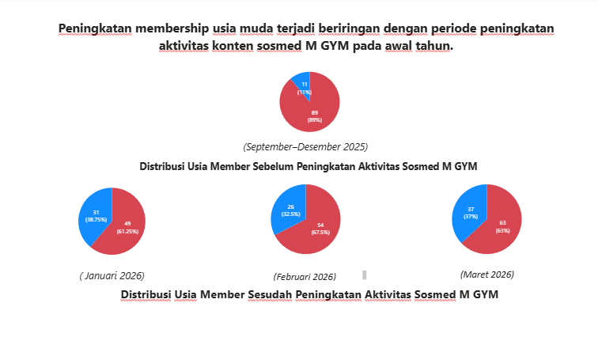

MGYM Social Media Impact on Youth Membership

BUSINESS BACKGROUND

In late 2025, MGYM observed that the majority of its members were from older age groups. To address this imbalance, the company began increasing its social media activity in early 2026 to attract a younger audience.

OBJECTIVE

This project aims to analyze whether the increase in social media activity correlates with a shift in membership demographics, particularly among younger members.

KEY FINDINGS

-From September to December 2025, older members dominated the membership composition (~89%)
-Starting January 2026, there is a gradual increase in younger members
-The shift continues through February and March 2026, indicating early signs of demographic change

##Dashboard Preview

BUSINESS INSIGHT

The data suggests that increased social media activity may be starting to reach and influence younger audiences. However, the shift is still gradual, indicating that sustained and consistent efforts are required to achieve significant impact.

RECOMMENDATIONS

-Maintain consistent social media (Tiktok and Instagram) campaigns targeting younger demographics
-Monitor conversion rates from social media engagement to actual memberships

TOOLS USED

-Python
-SQL
-Google Colab
-Power BI
